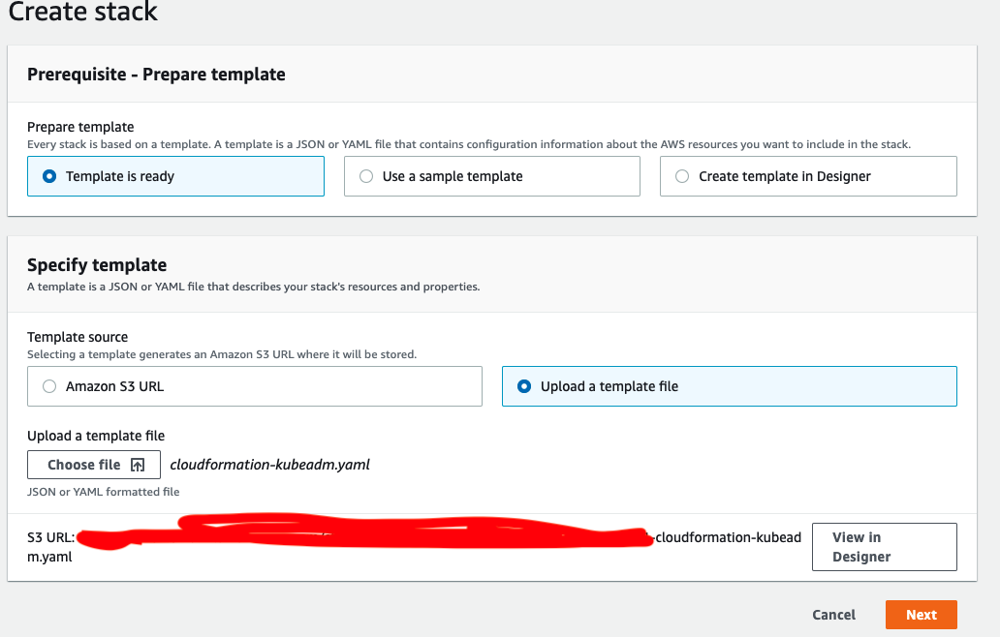
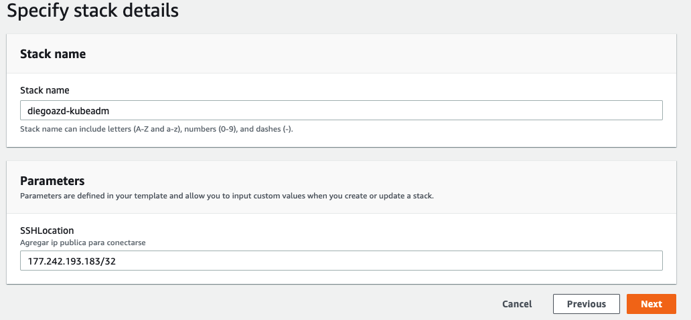
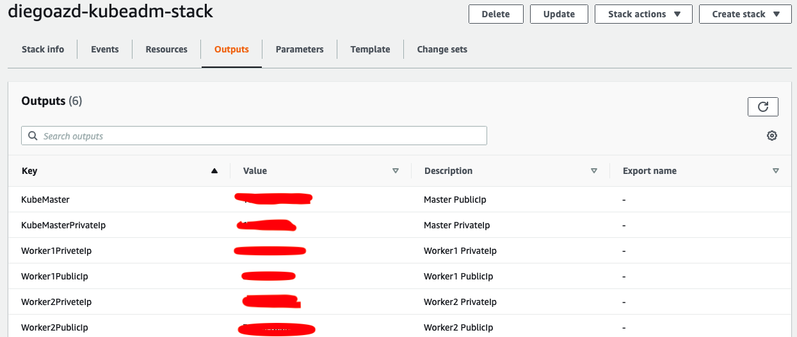
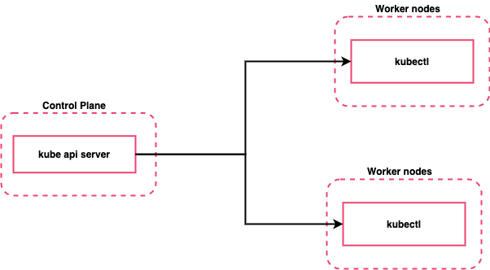

## Creacion cluster con un solo control plane  

### Creacion de instancias ec2  
#### verificar que la region sea Norte de Virginia  

  
Ir a CloudFormation/Create stack, seleccionar Upload a temlate file -> Choose file  
Dar en next    

  
Dar un nombre al stack y agregar la [ip publica](https://www.whatsmyip.org/)

  
En un ambiente de aws donde no se tienen permisos suficientes para crear los recursos se usan roles, seleccionar el rol cf-role-ec2, dar en create stack  

Esperar un par de minutos en lo que se crea el stack, seleccionar outputs  
  

En esta seccion nos muestra informacion de las ips para conectarse, conectarse a las 3 ips publicas con el siguiente comando  
```
ssh -i "ec2.pem" ubuntu@public-ip
```    
Nota: el pem debe tener los permisos 400 `sudo chmod 400 ec2.pem`  

  
1. Instalacion de container runtime(Containerd)  
2. Instalacion kubeadm, kubectl y kubelet  
3. Inicializacion del cluster  

Paso 1 y 2 hay que realizarse en todos los servidores(control plane y worker nodes)  

### Instalacion de container runtime  

Crear configuracion de containerd  
```
cat <<EOF | sudo tee /etc/modules-load.d/containerd.conf
overlay
br_netfilter
EOF
```    
Cargar modulos  
```
sudo modprobe overlay
sudo modprobe br_netfilter
```  
Agregan configuracion para kubernetes networking  
```
cat <<EOF | sudo tee /etc/sysctl.d/99-kubernetes-cri.conf
net.bridge.bridge-nf-call-iptables = 1
net.ipv4.ip_forward = 1
net.bridge.bridge-nf-call-ip6tables = 1
EOF
```  
Aplican los cambios sin reiniciar  
`sudo sysctl --system`  

Instala containerd  
`sudo apt-get update && sudo apt-get install -y containerd`  

Crear configuracion para containerd  
```
sudo mkdir -p /etc/containerd
sudo containerd config default | sudo tee /etc/containerd/config.toml
```  

Reiniciar y verificar estatus de containerd  
```
sudo systemctl restart containerd
sudo systemctl status containerd
```  

### Instalacion kubeadl, kubectl y kubelet  
Deshabilitar el swap  
`sudo swapoff -a`  

Deshabilita al iniciar la maquina  
`sudo sed -i '/ swap / s/^\(.*\)$/#\1/g' /etc/fstab`  

Instalacion dependencias de kubernetes  
```
sudo apt-get update && sudo apt-get install -y apt-transport-https curl jq

# Descargar paquetes de kubernetes y agregar kubernetes a la lista de repositorios  
curl -s https://packages.cloud.google.com/apt/doc/apt-key.gpg | sudo apt-key add -
cat <<EOF | sudo tee /etc/apt/sources.list.d/kubernetes.list
deb https://apt.kubernetes.io/ kubernetes-xenial main
EOF

# Instalacion kubernetes
sudo apt-get update
sudo apt-get install -y kubelet=1.21.0-00 kubeadm=1.21.0-00 kubectl=1.21.0-00
```  

Deshabilita los siguientes paquetes para que no actualicen automaticamente  
`sudo apt-mark hold kubelet kubeadm kubectl`  


NOTA:  
La instalacion de kubernetes y containerd se puede realizar con el siguiente script  
`sudo sh 7.1/install-k8s.sh`  

### Inicializacion de control plane  
```
sudo kubeadm init --pod-network-cidr 192.168.0.0/16 --kubernetes-version 1.21.0

# Configuracion de kubectl
mkdir -p $HOME/.kube
sudo cp -i /etc/kubernetes/admin.conf $HOME/.kube/config
sudo chown $(id -u):$(id -g) $HOME/.kube/config

kubectl get nodes
NAME          STATUS     ROLES                  AGE     VERSION
k8s-control   NotReady   control-plane,master   8m30s   v1.21.0
```  

Instalar el addon de red calico  
```
kubectl get pods -n kube-system
NAMESPACE     NAME                                                   READY   STATUS    RESTARTS   AGE
kube-system   coredns-558bd4d5db-bkmrd                               0/1     Pending   0          59s
kube-system   coredns-558bd4d5db-c2hbs                               0/1     Pending   0          59s
kube-system   etcd-1e77ed1bd01c.mylabserver.com                      1/1     Running   0          66s
kube-system   kube-apiserver-1e77ed1bd01c.mylabserver.com            1/1     Running   1          66s
kube-system   kube-controller-manager-1e77ed1bd01c.mylabserver.com   1/1     Running   0          66s
kube-system   kube-proxy-chlpd                                       1/1     Running   0          59s
kube-system   kube-scheduler-1e77ed1bd01c.mylabserver.com            1/1     Running   0          66s

kubectl apply -f https://docs.projectcalico.org/manifests/calico.yaml

kubectl get nodes
NAME          STATUS   ROLES                  AGE     VERSION
k8s-control   Ready    control-plane,master   9m46s   v1.21.0

kubectl get pods -n kube-system
```  
Revisar contenedores corriendo en cada nodo  
```
ps aux | grep containerd
sudo ctr -n k8s.io c list
```


### Unir worker nodes al lcuster
En cada worker node ejecutar  
```
sudo kubeadm join 10.0.1.101:6443 --token <TOKEN> \
        --discovery-token-ca-cert-hash <sha256-HASH>
```  

Ejecutar en el nodo maestro  
```
kubectl get nodes
NAME          STATUS   ROLES                  AGE   VERSION
k8s-control   Ready    control-plane,master   11m   v1.21.0
k8s-worker1   Ready    <none>                 41s   v1.21.0
k8s-worker2   Ready    <none>                 23s   v1.21.0
```
Probar la instalacion  
```
kubectl run nginx --image=nginx
```
